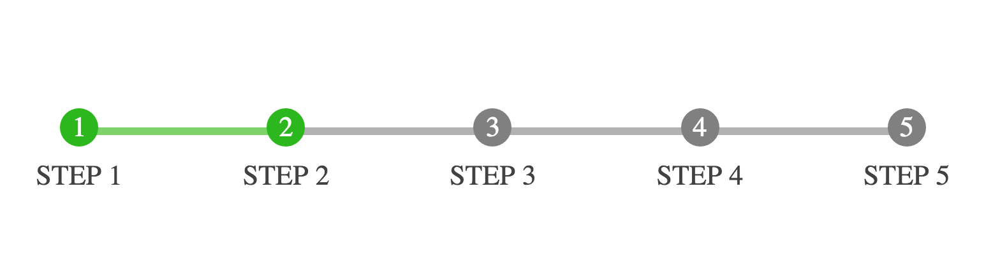
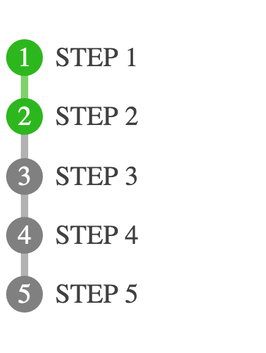
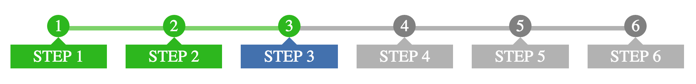
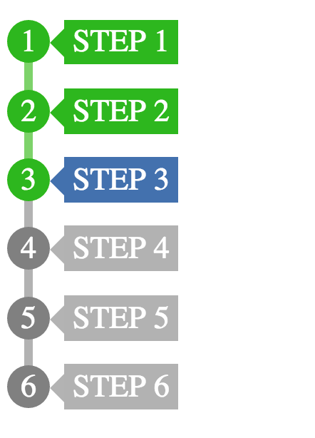

# Responsive Step Progress Indicator
A Responsive Step Progress Bar based on CSS. We looked around the web and didn't see anything that actually had a responsive element beyond hiding text.
  
**Basic Example in Wide View**  
  
  
**Basic Example in Narrow View**  
  
  
**Boxed Example in Wide View**  
  
  
**Boxed Example in Wide View**  
  
  
## SASS for Easy Color Styling  
There are only 3 colors to make this work. Note that the connecting line, and default boxes are 60% transparent. [SASS](http://sass-lang.com/) is great because it allows the use of variables.
  
	  $ProgressBase: rgb(128, 128, 128);  
	  $ProgressComplete: rgb(35, 185, 0);  
	  $ProgressCurrent: rgb(65, 112, 176);  
  
## Using it with your SASS  
It's really simple to drop your existing color definitions inside of here. Simply comment out the definitions in the SCSS file and then add in something similar to the following where the $Color-_val_ is your value.
  
	$ProgressBase: $Color-Base;
	$ProgressComplete: $Color-Green;
	$ProgressCurrent: $Color-Blue;
	@import 'interface/ProgressIndicator.scss';		// This holds all stepped progress indicator

	sass style/ProgressIndicator.scss style/ProgressIndicator.css --style compressed  
  
#Licensed under MIT  
Just use it, if you expand it let us know so we can add more to the repo.